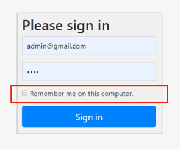

## 인증 API - Remember-Me 쿠키 인증

1. 세션이 만료되고 웹 브라우저가 종료된 후에도 애플리케이션이 사용자를 기억하는 기능
2. Remember-Me 쿠키에 대한 http 요청을 확인한 후, 토큰기반 인증을 사용해 유효성을 검사하고
토큰이 검증되면 사용자는 로그인된다
3. 사용자 라이프 사이클
   - 인증 성공 -> Remember-Me 쿠키 설정
   - 인증 실패 -> 쿠키가 존재하면 쿠키 무효화
   - 로그아웃 -> 쿠키가 존재하면 쿠키 무효화
### RememberMe 인증필터: RememberMeAuthenticationFilter
**최초 로그인시, remember-me 속성을 활성화하여 인증을 받으면** rememberme 쿠키를 서버로부터 받게 된다.
이후 요청헤더에 rememberme 쿠키를 달고 요청을 보낸다면, 세션이 만료되거나, 시큐리티 컨텍스트의 Authentication 객체가 null 이어도 인증을
유효하게 만드는 것이 바로 이 RememberMeAuthenticationFilter 이다.

다음 두가지 조건에서 동작한다.
1) Authentication 인증객체가 null 이고,
2) 요청헤더에 rememberme 쿠키가 있을 때

